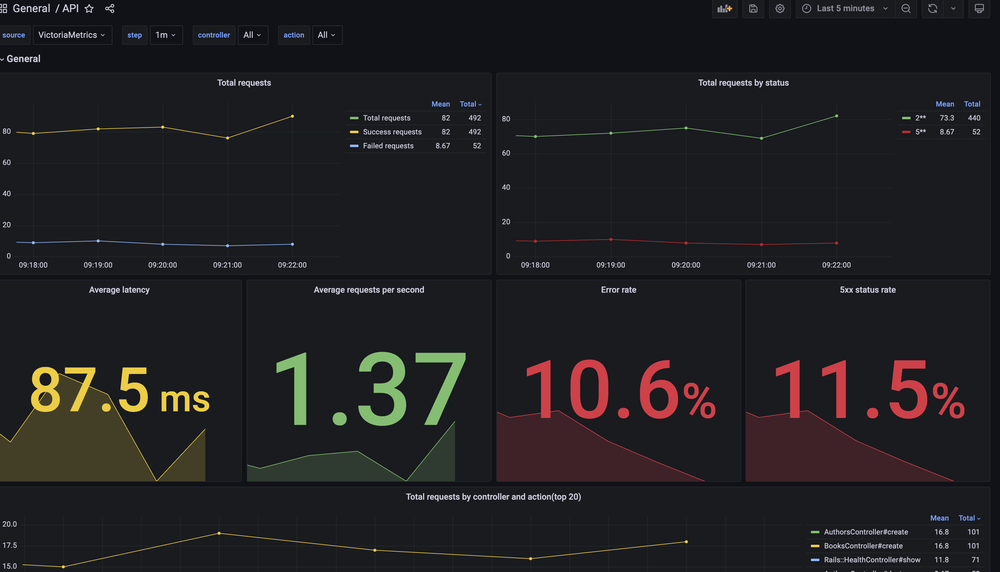
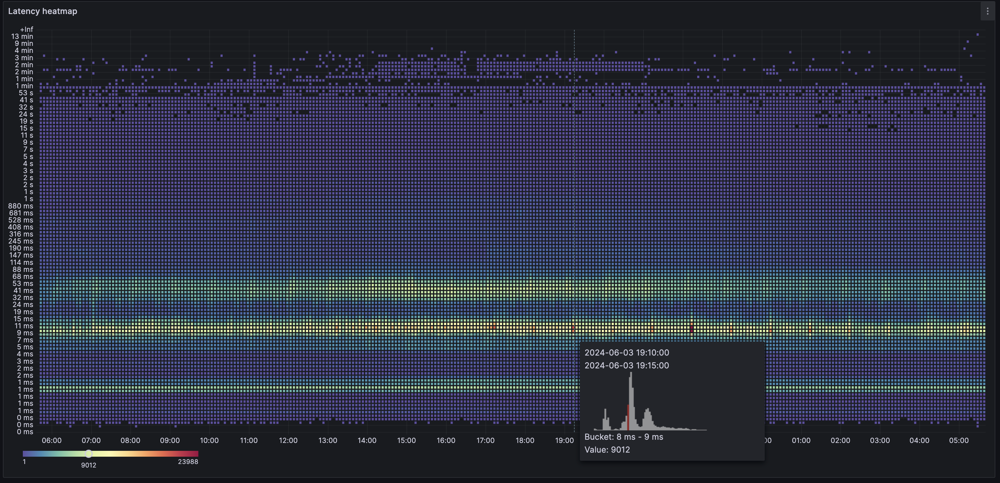
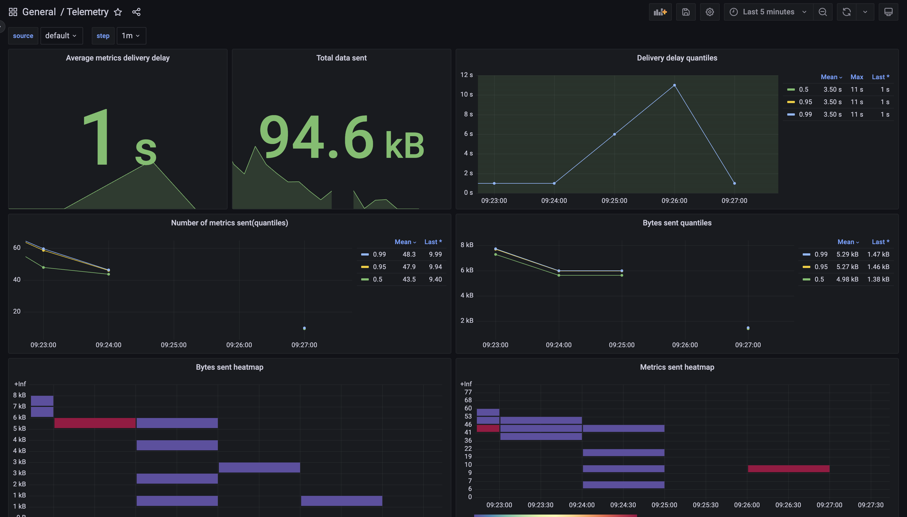

# README

This is a Rails app with a simple API and metrics collected and stored in VictoriaMetrics.

Article about this project: TODO: add link

## Getting Started

To get started with this Rails app, follow these steps:

1. Clone the repository.
2. Run `docker compose up`.

Project is fully dockerized and eveything is set up to run the project with a single command.

Services:
- rails web server(0.0.0.0:3000)  
- postgres  
- traffic_emulation  
  Rake task that simulates api traffic. It creates, reads, updates and deletes books and authors.
- vmagent  
  VictoriaMetrics agent that accepts and aggregates metrics from the app and stores them in VictoriaMetrics.
- VictoriaMetrics  
  Time-series database for our metrics
- grafana(0.0.0.0:3001)  
  Default user is `admin` and password is `admin`. Here we can see the collected metrics

## Metrics Collection

In this demo app, we mainly collect metrics from our api:
- total number of requests(`rails.request.total`)
- time taken to process requests(`rails.request.time`)
- time spent in database(`rails.request.time.db`)

Metrics are collected by [dogstatsd-ruby](https://github.com/DataDog/dogstatsd-ruby) gem since it has good [threading model](https://github.com/DataDog/dogstatsd-ruby?tab=readme-ov-file#threading-model) and also it reports telemetry which improves observability.

Metrics are aggregated by vmagent every 5 seconds, this is described in more detail in the article TODO: add link.

## Grafana Dashboars
Grafana is provisioned with a few dashboards to visualize the metrics collected by the app:
- API Metrics  
  This dashboard shows the most needed metrics for the API such as total number of requests, latency, time spent in the database. Also proper quantiles with ability to filter by controller and action. Basically a simple APM.
  
  
  
  My favourite part here is latency heatmap, here how it can look like on a real production:
  
- Telemetry(by dogstatsd-ruby)  
  Here we can see how many metrics are sent, how many is dropped and what is a delivery delay  

- Default vmagent dashboard  
  Shows everything needed to monitor vmagent
- Default VictoriaMetrics dashboard  
  Shows everything needed to monitor VictoriaMetrics
